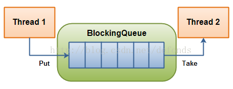
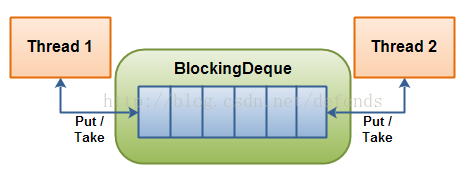
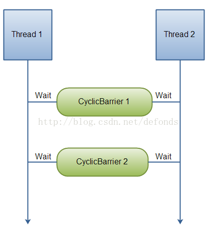
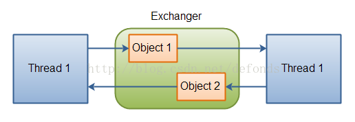

## 译序
本指南根据 Jakob Jenkov 最新博客翻译，[请随时关注博客更新](http://tutorials.jenkov.com/java-util-concurrent/index.html)

本指南已做成中英文对照阅读版的 pdf 文档，有兴趣的朋友可以去 [Java并发工具包java.util.concurrent用户指南中英文对照阅读版](http://download.csdn.net/detail/defonds/8469189) 进行下载。

## 1. java.util.concurrent - Java并发工具包

Java 5 添加了一个新的包到 Java 平台，java.util.concurrent 包。这个包包含有一系列能够让 Java 的并发编程变得更加简单轻松的类。在这个包被添加以前，你需要自己去动手实现自己的相关工具类。

本文我将带你一一认识 java.util.concurrent 包里的这些类，然后你可以尝试着如何在项目中使用它们。本文中我将使用 Java 6 版本，我不确定这和 Java 5 版本里的是否有一些差异。

我不会去解释关于 Java 并发的核心问题 - 其背后的原理，也就是说，如果你对那些东西感兴趣，参考[《Java 并发指南》](http://tutorials.jenkov.com/java-concurrency/index.html)

### 半成品

本文很大程度上还是个 "半成品"，所以当你发现一些被漏掉的类或接口时，请耐心等待。在我空闲的时候会把它们加进来的。

## 2. 阻塞队列BlockingQueue

java.util.concurrent 包里的 BlockingQueue 接口表示一个线程安放入和提取实例的队列。本小节我将给你演示如何使用这个 BlockingQueue。

本节不会讨论如何在 Java 中实现一个你自己的 BlockingQueue。如果你对那个感兴趣，参考[《Java 并发指南》](http://tutorials.jenkov.com/java-concurrency/index.html)

### 2.1 BlockingQueue用法

BlockingQueue 通常用于一个线程生产对象，而另外一个线程消费这些对象的场景。下图是对这个原理的阐述：



一个线程往里边放，另外一个线程从里边取的一个 BlockingQueue。

一个线程将会持续生产新对象并将其插入到队列之中，直到队列达到它所能容纳的临界点。也就是说，它是有限的。如果该阻塞队列到达了其临界点，负责生产的线程将会在往里边插入新对象时发生阻塞。它会一直处于阻塞之中，直到负责消费的线程从队列中拿走一个对象。

负责消费的线程将会一直从该阻塞队列中拿出对象。如果消费线程尝试去从一个空的队列中提取对象的话，这个消费线程将会处于阻塞之中，直到一个生产线程把一个对象丢进队列。

### 2.2 BlockingQueue的方法

BlockingQueue 具有 4 组不同的方法用于插入、移除以及对队列中的元素进行检查。如果请求的操作不能得到立即执行的话，每个方法的表现也不同。这些方法如下：

| 操作   | 抛异常        | 特定值      | 阻塞      | 超时                          |
| :--- | :--------- | :------- | :------ | :-------------------------- |
| 插入   | add(o)     | offer(o) | put(o)  | offer(o, timeout, timeunit) |
| 移除   | remove(o)  | poll(o)  | take(o) | poll(timeout, timeunit)     |
| 检查   | element(o) | peek(o)  | 无       | 无                           |

四组不同的行为方式解释：

- 抛异常：如果试图的操作无法立即执行，抛一个异常。
- 特定值：如果试图的操作无法立即执行，返回一个特定的值(常常是 true / false)。
- 阻塞：如果试图的操作无法立即执行，该方法调用将会发生阻塞，直到能够执行。
- 超时：如果试图的操作无法立即执行，该方法调用将会发生阻塞，直到能够执行，但等待时间不会超过给定值。返回一个特定值以告知该操作是否成功(典型的是 true / false)。

无法向一个 BlockingQueue 中插入 null。如果你试图插入 null，BlockingQueue 将会抛出一个 NullPointerException。
可以访问到 BlockingQueue 中的所有元素，而不仅仅是开始和结束的元素。比如说，你将一个对象放入队列之中以等待处理，但你的应用想要将其取消掉。那么你可以调用诸如 remove(o) 方法来将队列之中的特定对象进行移除。但是这么干效率并不高(译者注：基于队列的数据结构，获取除开始或结束位置的其他对象的效率不会太高)，因此你尽量不要用这一类的方法，除非你确实不得不那么做。

### 2.3 BlockingQueue的实现
BlockingQueue 是个接口，你需要使用它的实现之一来使用 BlockingQueue。java.util.concurrent 具有以下 BlockingQueue 接口的实现(Java 6)：

- ArrayBlockingQueue
- DelayQueue
- LinkedBlockingQueue
- PriorityBlockingQueue
- SynchronousQueue

### 2.4 Java中使用BlockingQueue的例子

这里是一个 Java 中使用 BlockingQueue 的示例。本示例使用的是 BlockingQueue 接口的 ArrayBlockingQueue 实现。

首先，BlockingQueueExample 类分别在两个独立的线程中启动了一个 Producer 和 一个 Consumer。Producer 向一个共享的 BlockingQueue 中注入字符串，而 Consumer 则会从中把它们拿出来。

```java
public class BlockingQueueExample {  

    public static void main(String[] args) throws Exception {  

        BlockingQueue queue = new ArrayBlockingQueue(1024);  

        Producer producer = new Producer(queue);  
        Consumer consumer = new Consumer(queue);  

        new Thread(producer).start();  
        new Thread(consumer).start();  

        Thread.sleep(4000);  
    }  
}  
```

以下是 Producer 类。注意它在每次 put() 调用时是如何休眠一秒钟的。这将导致 Consumer 在等待队列中对象的时候发生阻塞。
```java
public class Producer implements Runnable{  

    protected BlockingQueue queue = null;  

    public Producer(BlockingQueue queue) {  
        this.queue = queue;  
    }  

    public void run() {  
        try {  
            queue.put("1");  
            Thread.sleep(1000);  
            queue.put("2");  
            Thread.sleep(1000);  
            queue.put("3");  
        } catch (InterruptedException e) {  
            e.printStackTrace();  
        }  
    }  
}  
```

以下是 Consumer 类。它只是把对象从队列中抽取出来，然后将它们打印到 System.out
```java
public class Consumer implements Runnable{  

    protected BlockingQueue queue = null;  

    public Consumer(BlockingQueue queue) {  
        this.queue = queue;  
    }  

    public void run() {  
        try {  
            System.out.println(queue.take());  
            System.out.println(queue.take());  
            System.out.println(queue.take());  
        } catch (InterruptedException e) {  
            e.printStackTrace();  
        }  
    }  
}  
```
## 3. 数组阻塞队列ArrayBlockingQueue
ArrayBlockingQueue 类实现了 BlockingQueue 接口。

ArrayBlockingQueue 是一个有界的阻塞队列，其内部实现是将对象放到一个数组里。有界也就意味着，它不能够存储无限多数量的元素。它有一个同一时间能够存储元素数量的上限。你可以在对其初始化的时候设定这个上限，但之后就无法对这个上限进行修改了(译者注：因为它是基于数组实现的，也就具有数组的特性：一旦初始化，大小就无法修改)。

ArrayBlockingQueue 内部以 FIFO(先进先出)的顺序对元素进行存储。队列中的头元素在所有元素之中是放入时间最久的那个，而尾元素则是最短的那个。

以下是在使用  ArrayBlockingQueue 的时候对其初始化的一个示例：

```java
BlockingQueue queue = new ArrayBlockingQueue(1024);  
queue.put("1");  
Object object = queue.take();  
```

以下是使用了 Java 泛型的一个 BlockingQueue 示例。注意其中是如何对 String 元素放入和提取的：
```java
BlockingQueue<String> queue = new ArrayBlockingQueue<String>(1024);  
queue.put("1");  
String string = queue.take();  
```

## 4. 延迟队列DelayQueue
DelayQueue 实现了 BlockingQueue 接口。

DelayQueue 对元素进行持有直到一个特定的延迟到期。注入其中的元素必须实现 java.util.concurrent.Delayed 接口，该接口定义：

```java
public interface Delayed extends Comparable<Delayed> {  

 public long getDelay(TimeUnit timeUnit);  

}  
```
DelayQueue 将会在每个元素的 getDelay() 方法返回的值的时间段之后才释放掉该元素。如果返回的是 0 或者负值，延迟将被认为过期，该元素将会在 DelayQueue 的下一次 take  被调用的时候被释放掉。

传递给 getDelay 方法的 getDelay 实例是一个枚举类型，它表明了将要延迟的时间段。TimeUnit 枚举将会取以下值：

- DAYS
- HOURS
- MINUTES
- SECONDS
- MILLISECONDS
- MICROSECONDS
- NANOSECONDS

正如你所看到的，Delayed 接口也继承了 java.lang.Comparable 接口，这也就意味着 Delayed 对象之间可以进行对比。这个可能在对 DelayQueue 队列中的元素进行排序时有用，因此它们可以根据过期时间进行有序释放。

以下是使用 DelayQueue 的例子：

```java
public class DelayQueueExample {  

    public static void main(String[] args) {  
        DelayQueue queue = new DelayQueue();  
        Delayed element1 = new DelayedElement();  
        queue.put(element1);  
        Delayed element2 = queue.take();  
    }  
}  
```
DelayedElement 是我所创建的一个 DelayedElement 接口的实现类，它不在 Java.util.concurrent 包里。你需要自行创建你自己的 Delayed 接口的实现以使用 DelayQueue 类。


## 5. 链阻塞队列LinkedBlockingQueue
LinkedBlockingQueue 类实现了 BlockingQueue 接口。

LinkedBlockingQueue 内部以一个链式结构(链接节点)对其元素进行存储。如果需要的话，这一链式结构可以选择一个上限。如果没有定义上限，将使用 Integer.MAX_VALUE 作为上限。

LinkedBlockingQueue 内部以 FIFO(先进先出)的顺序对元素进行存储。队列中的头元素在所有元素之中是放入时间最久的那个，而尾元素则是最短的那个。

以下是 LinkedBlockingQueue 的初始化和使用示例代码：

```java
BlockingQueue<String> unbounded = new LinkedBlockingQueue<String>();  
BlockingQueue<String> bounded   = new LinkedBlockingQueue<String>(1024);  
bounded.put("Value");  
String value = bounded.take();  
```

## 6. 具有优先级的阻塞队列PriorityBlockingQueue
PriorityBlockingQueue 类实现了 BlockingQueue 接口。

PriorityBlockingQueue 是一个无界的并发队列。它使用了和类 java.util.PriorityQueue 一样的排序规则。你无法向这个队列中插入 null 值。

所有插入到 PriorityBlockingQueue 的元素必须实现 java.lang.Comparable 接口。因此该队列中元素的排序就取决于你自己的 Comparable 实现。

注意 PriorityBlockingQueue 对于具有相等优先级(compare() == 0)的元素并不强制任何特定行为。
同时注意，如果你从一个 PriorityBlockingQueue 获得一个 Iterator 的话，该 Iterator 并不能保证它对元素的遍历是以优先级为序的。

以下是使用 PriorityBlockingQueue 的示例：

```java
BlockingQueue queue   = new PriorityBlockingQueue();  
//String implements java.lang.Comparable  
queue.put("Value");  
String value = queue.take();  
```

## 7. 同步队列SynchronousQueue

SynchronousQueue 类实现了 BlockingQueue 接口。

SynchronousQueue 是一个特殊的队列，它的内部同时只能够容纳单个元素。如果该队列已有一元素的话，试图向队列中插入一个新元素的线程将会阻塞，直到另一个线程将该元素从队列中抽走。同样，如果该队列为空，试图向队列中抽取一个元素的线程将会阻塞，直到另一个线程向队列中插入了一条新的元素。

据此，把这个类称作一个队列显然是夸大其词了。它更多像是一个汇合点。


## 8. 阻塞双端队列BlockingDeque
java.util.concurrent 包里的 BlockingDeque 接口表示一个线程安放入和提取实例的双端队列。本小节我将给你演示如何使用 BlockingDeque。

BlockingDeque 类是一个双端队列，在不能够插入元素时，它将阻塞住试图插入元素的线程；在不能够抽取元素时，它将阻塞住试图抽取的线程。

deque(双端队列) 是 "Double Ended Queue" 的缩写。因此，双端队列是一个你可以从任意一端插入或者抽取元素的队列。

### BlockingDeque的使用

在线程既是一个队列的生产者又是这个队列的消费者的时候可以使用到 BlockingDeque。如果生产者线程需要在队列的两端都可以插入数据，消费者线程需要在队列的两端都可以移除数据，这个时候也可以使用 BlockingDeque。BlockingDeque 图解：



一个 BlockingDeque - 线程在双端队列的两端都可以插入和提取元素。

一个线程生产元素，并把它们插入到队列的任意一端。如果双端队列已满，插入线程将被阻塞，直到一个移除线程从该队列中移出了一个元素。如果双端队列为空，移除线程将被阻塞，直到一个插入线程向该队列插入了一个新元素。

### BlockingDeque的方法

BlockingDeque 具有 4 组不同的方法用于插入、移除以及对双端队列中的元素进行检查。如果请求的操作不能得到立即执行的话，每个方法的表现也不同。这些方法如下：

| 操作   | 抛异常            | 特定值           | 阻塞           | 超时                               |
| :--- | :------------- | :------------ | :----------- | :------------------------------- |
| 插入   | addFirst(o)    | offerFirst(o) | putFirst(o)  | offerFirst(o, timeout, timeunit) |
| 移除   | removeFirst(o) | pollFirst(o)  | takeFirst(o) | pollFirst(timeout, timeunit)     |
| 检查   | getFirst(o)    | peekFirst(o)  | 无            | 无                                |

| 操作   | 抛异常           | 特定值          | 阻塞          | 超时                              |
| :--- | :------------ | :----------- | :---------- | :------------------------------ |
| 插入   | addLast(o)    | offerLast(o) | putLast(o)  | offerLast(o, timeout, timeunit) |
| 移除   | removeLast(o) | pollLast(o)  | takeLast(o) | pollLast(timeout, timeunit)     |
| 检查   | getLast(o)    | peekLast(o)  | 无           | 无                               |

四组不同的行为方式解释：

- 抛异常：如果试图的操作无法立即执行，抛一个异常。
- 特定值：如果试图的操作无法立即执行，返回一个特定的值(常常是 true / false)。
- 阻塞：如果试图的操作无法立即执行，该方法调用将会发生阻塞，直到能够执行。
- 超时：如果试图的操作无法立即执行，该方法调用将会发生阻塞，直到能够执行，但等待时间不会超过给定值。返回一个特定值以告知该操作是否成功(典型的是 true / false)。

### BlockingDeque 继承自BlockingQueue

BlockingDeque 接口继承自 BlockingQueue 接口。这就意味着你可以像使用一个 BlockingQueue 那样使用BlockingDeque。如果你这么干的话，各种插入方法将会把新元素添加到双端队列的尾端，而移除方法将会把双端队列的首端的元素移除。正如 BlockingQueue 接口的插入和移除方法一样。

以下是 BlockingDeque 对 BlockingQueue 接口的方法的具体内部实现：

| BlockingQueue        | BlockingDeque            |
| :------------------- | :----------------------- |
| add()                | addLast()                |
| offer()              | offerLast()              |
| put()                | putLast()                |
| offer(e, time, unit) | offerLast(e, time, unit) |
| remove()             | removeFirst()            |
| poll()               | pollFirst()              |
| take()               | takeFirst()              |
| poll(time, unit)     | pollLast(time, unit)     |
| element()            | getFirst()               |
| peek()               | peekFirst()              |

### BlockingDeque 的实现

既然 BlockingDeque 是一个接口，那么你想要使用它的话就得使用它的众多的实现类的其中一个。java.util.concurrent 包提供了以下 BlockingDeque 接口的实现类：LinkedBlockingDeque

### BlockingDeque 代码示例

以下是如何使用 BlockingDeque 方法的一个简短代码示例：

```java
BlockingDeque<String> deque = new LinkedBlockingDeque<String>();  

deque.addFirst("1");  
deque.addLast("2");  

String two = deque.takeLast();  
String one = deque.takeFirst();  
```


## 9. 链阻塞双端队列 LinkedBlockingDeque
LinkedBlockingDeque 类实现了 BlockingDeque 接口。

deque(双端队列) 是 "Double Ended Queue" 的缩写。因此，双端队列是一个你可以从任意一端插入或者抽取元素的队列。

LinkedBlockingDeque 是一个双端队列，在它为空的时候，一个试图从中抽取数据的线程将会阻塞，无论该线程是试图从哪一端抽取数据。

以下是 LinkedBlockingDeque 实例化以及使用的示例：

```java
BlockingDeque<String> deque = new LinkedBlockingDeque<String>();  

deque.addFirst("1");  
deque.addLast("2");  

String two = deque.takeLast();  
String one = deque.takeFirst();  
```


## 10. 并发 Map(映射) ConcurrentMap
### java.util.concurrent.ConcurrentMap

java.util.concurrent.ConcurrentMap 接口表示了一个能够对别人的访问(插入和提取)进行并发处理的 java.util.Map。
ConcurrentMap 除了从其父接口 java.util.Map 继承来的方法之外还有一些额外的原子性方法。

### ConcurrentMap的实现

既然 ConcurrentMap 是个接口，你想要使用它的话就得使用它的实现类之一。java.util.concurrent 包具备 ConcurrentMap 接口的以下实现类：ConcurrentHashMap

### ConcurrentHashMap

ConcurrentHashMap 和 java.util.HashTable 类很相似，但 ConcurrentHashMap 能够提供比 HashTable 更好的并发性能。在你从中读取对象的时候 ConcurrentHashMap 并不会把整个 Map 锁住。此外，在你向其中写入对象的时候，ConcurrentHashMap 也不会锁住整个 Map。它的内部只是把 Map 中正在被写入的部分进行锁定。

另外一个不同点是，在被遍历的时候，即使是 ConcurrentHashMap 被改动，它也不会抛ConcurrentModificationException。尽管 Iterator 的设计不是为多个线程的同时使用。

更多关于 ConcurrentMap 和 ConcurrentHashMap 的细节请参考官方文档。

### ConcurrentMap 例子

以下是如何使用 ConcurrentMap 接口的一个例子。本示例使用了 ConcurrentHashMap 实现类：

```java
ConcurrentMap concurrentMap = new ConcurrentHashMap();  

concurrentMap.put("key", "value");  

Object value = concurrentMap.get("key");  
```


## 11. 并发导航映射 ConcurrentNavigableMap
java.util.concurrent.ConcurrentNavigableMap 是一个支持并发访问的 java.util.NavigableMap，它还能让它的子 map 具备并发访问的能力。所谓的 "子 map" 指的是诸如 headMap()，subMap()，tailMap() 之类的方法返回的 map。

NavigableMap 中的方法不再赘述，本小节我们来看一下 ConcurrentNavigableMap 添加的方法。

### headMap()

headMap(T toKey) 方法返回一个包含了小于给定 toKey 的 key 的子 map。
如果你对原始 map 里的元素做了改动，这些改动将影响到子 map 中的元素(译者注：map 集合持有的其实只是对象的引用)。

以下示例演示了对 headMap() 方法的使用：

```java
ConcurrentNavigableMap map = new ConcurrentSkipListMap();  

map.put("1", "one");  
map.put("2", "two");  
map.put("3", "three");  

ConcurrentNavigableMap headMap = map.headMap("2");  
```

headMap 将指向一个只含有键 "1" 的 ConcurrentNavigableMap，因为只有这一个键小于 "2"。关于这个方法及其重载版本具体是怎么工作的细节请参考 Java 文档。

### tailMap()

tailMap(T fromKey) 方法返回一个包含了不小于给定 fromKey 的 key 的子 map。
如果你对原始 map 里的元素做了改动，这些改动将影响到子 map 中的元素(译者注：map 集合持有的其实只是对象的引用)。

以下示例演示了对 tailMap() 方法的使用：

```java
ConcurrentNavigableMap map = new ConcurrentSkipListMap();  

map.put("1", "one");  
map.put("2", "two");  
map.put("3", "three");  

ConcurrentNavigableMap tailMap = map.tailMap("2");  
```
tailMap 将拥有键 "2" 和 "3"，因为它们不小于给定键 "2"。关于这个方法及其重载版本具体是怎么工作的细节请参考 Java 文档。

### subMap()

subMap() 方法返回原始 map 中，键介于 from(包含) 和 to (不包含) 之间的子 map。示例如下：

```java
ConcurrentNavigableMap map = new ConcurrentSkipListMap();  

map.put("1", "one");  
map.put("2", "two");  
map.put("3", "three");  

ConcurrentNavigableMap subMap = map.subMap("2", "3");  
```
返回的 submap 只包含键 "2"，因为只有它满足不小于 "2"，比 "3" 小。

### 更多方法

ConcurrentNavigableMap 接口还有其他一些方法可供使用，比如：

- descendingKeySet()
- descendingMap()
- navigableKeySet()

关于这些方法更多信息参考官方 Java 文档。


## 12. 闭锁 CountDownLatch
java.util.concurrent.CountDownLatch 是一个并发构造，它允许一个或多个线程等待一系列指定操作的完成。
CountDownLatch 以一个给定的数量初始化。countDown() 每被调用一次，这一数量就减一。通过调用 await() 方法之一，线程可以阻塞等待这一数量到达零。

以下是一个简单示例。Decrementer 三次调用 countDown() 之后，等待中的 Waiter 才会从 await() 调用中释放出来。

```java
CountDownLatch latch = new CountDownLatch(3);  

Waiter      waiter      = new Waiter(latch);  
Decrementer decrementer = new Decrementer(latch);  

new Thread(waiter).start();  
new Thread(decrementer).start();  

Thread.sleep(4000);  

public class Waiter implements Runnable{  

    CountDownLatch latch = null;  

    public Waiter(CountDownLatch latch) {  
        this.latch = latch;  
    }  

    public void run() {  
        try {  
            latch.await();  
        } catch (InterruptedException e) {  
            e.printStackTrace();  
        }  

        System.out.println("Waiter Released");  
    }  
}  

public class Decrementer implements Runnable {  

    CountDownLatch latch = null;  

    public Decrementer(CountDownLatch latch) {  
        this.latch = latch;  
    }  

    public void run() {  

        try {  
            Thread.sleep(1000);  
            this.latch.countDown();  

            Thread.sleep(1000);  
            this.latch.countDown();  

            Thread.sleep(1000);  
            this.latch.countDown();  
        } catch (InterruptedException e) {  
            e.printStackTrace();  
        }  
    }  
}   
```

## 13. 栅栏 CyclicBarrier

java.util.concurrent.CyclicBarrier 类是一种同步机制，它能够对处理一些算法的线程实现同步。换句话讲，它就是一个所有线程必须等待的一个栅栏，直到所有线程都到达这里，然后所有线程才可以继续做其他事情。图示如下：



两个线程在栅栏旁等待对方。
通过调用 CyclicBarrier 对象的 await() 方法，两个线程可以实现互相等待。一旦 N 个线程在等待 CyclicBarrier 达成，所有线程将被释放掉去继续运行。

### 创建一个 CyclicBarrier

在创建一个 CyclicBarrier 的时候你需要定义有多少线程在被释放之前等待栅栏。创建 CyclicBarrier 示例：

```java
CyclicBarrier barrier = new CyclicBarrier(2);  
```

### 等待一个 CyclicBarrier

以下演示了如何让一个线程等待一个 CyclicBarrier：

```java
barrier.await();  
```

当然，你也可以为等待线程设定一个超时时间。等待超过了超时时间之后，即便还没有达成 N 个线程等待 CyclicBarrier 的条件，该线程也会被释放出来。以下是定义超时时间示例：
```java
barrier.await(10, TimeUnit.SECONDS);  
```

满足以下任何条件都可以让等待 CyclicBarrier 的线程释放：

- 最后一个线程也到达 CyclicBarrier(调用 await())
- 当前线程被其他线程打断(其他线程调用了这个线程的 interrupt() 方法)
- 其他等待栅栏的线程被打断
- 其他等待栅栏的线程因超时而被释放
- 外部线程调用了栅栏的 CyclicBarrier.reset() 方法

### CyclicBarrier 行动
CyclicBarrier 支持一个栅栏行动，栅栏行动是一个 Runnable 实例，一旦最后等待栅栏的线程抵达，该实例将被执行。你可以在 CyclicBarrier 的构造方法中将 Runnable 栅栏行动传给它：

```java
Runnable      barrierAction = ... ;  
CyclicBarrier barrier       = new CyclicBarrier(2, barrierAction);  
```

### CyclicBarrier 示例

以下代码演示了如何使用 CyclicBarrier：

```java
Runnable barrier1Action = new Runnable() {  
    public void run() {  
        System.out.println("BarrierAction 1 executed ");  
    }  
};  
Runnable barrier2Action = new Runnable() {  
    public void run() {  
        System.out.println("BarrierAction 2 executed ");  
    }  
};  

CyclicBarrier barrier1 = new CyclicBarrier(2, barrier1Action);  
CyclicBarrier barrier2 = new CyclicBarrier(2, barrier2Action);  

CyclicBarrierRunnable barrierRunnable1 =  new CyclicBarrierRunnable(barrier1, barrier2);  

CyclicBarrierRunnable barrierRunnable2 =  new CyclicBarrierRunnable(barrier1, barrier2);  

new Thread(barrierRunnable1).start();  
new Thread(barrierRunnable2).start();  
```

CyclicBarrierRunnable 类：

```java
public class CyclicBarrierRunnable implements Runnable{  

    CyclicBarrier barrier1 = null;  
    CyclicBarrier barrier2 = null;  

    public CyclicBarrierRunnable(  
            CyclicBarrier barrier1,  
            CyclicBarrier barrier2) {  

        this.barrier1 = barrier1;  
        this.barrier2 = barrier2;  
    }  

    public void run() {  
        try {  
            Thread.sleep(1000);  
            System.out.println(Thread.currentThread().getName() +  
                                " waiting at barrier 1");  
            this.barrier1.await();  

            Thread.sleep(1000);  
            System.out.println(Thread.currentThread().getName() +  
                                " waiting at barrier 2");  
            this.barrier2.await();  

            System.out.println(Thread.currentThread().getName() +  
                                " done!");  

        } catch (InterruptedException e) {  
            e.printStackTrace();  
        } catch (BrokenBarrierException e) {  
            e.printStackTrace();  
        }  
    }  
}  
```

以上代码控制台输出如下。注意每个线程写入控制台的时序可能会跟你实际执行不一样。比如有时 Thread-0 先打印，有时 Thread-1 先打印。
```
Thread-0 waiting at barrier 1
Thread-1 waiting at barrier 1
BarrierAction 1 executed
Thread-1 waiting at barrier 2
Thread-0 waiting at barrier 2
BarrierAction 2 executed
Thread-0 done!
Thread-1 done!
```

## 14. 交换机 Exchanger
java.util.concurrent.Exchanger 类表示一种两个线程可以进行互相交换对象的会和点。这种机制图示如下：



两个线程通过一个 Exchanger 交换对象。

交换对象的动作由 Exchanger 的两个 exchange() 方法的其中一个完成。以下是一个示例：

```java
Exchanger exchanger = new Exchanger();  

ExchangerRunnable exchangerRunnable1 =  
        new ExchangerRunnable(exchanger, "A");  

ExchangerRunnable exchangerRunnable2 =  
        new ExchangerRunnable(exchanger, "B");  

new Thread(exchangerRunnable1).start();  
new Thread(exchangerRunnable2).start();  
ExchangerRunnable 代码：
​```java
public class ExchangerRunnable implements Runnable{  

    Exchanger exchanger = null;  
    Object    object    = null;  

    public ExchangerRunnable(Exchanger exchanger, Object object) {  
        this.exchanger = exchanger;  
        this.object = object;  
    }  

    public void run() {  
        try {  
            Object previous = this.object;  

            this.object = this.exchanger.exchange(this.object);  

            System.out.println(  
                    Thread.currentThread().getName() +  
                    " exchanged " + previous + " for " + this.object  
            );  
        } catch (InterruptedException e) {  
            e.printStackTrace();  
        }  
    }  
}  
```

以上程序输出：

```
Thread-0 exchanged A for B
Thread-1 exchanged B for A
```

## 15. 信号量 Semaphore

java.util.concurrent.Semaphore 类是一个计数信号量。这就意味着它具备两个主要方法：

```java
acquire()
release()
```

计数信号量由一个指定数量的 "许可" 初始化。每调用一次 acquire()，一个许可会被调用线程取走。每调用一次 release()，一个许可会被返还给信号量。因此，在没有任何 release() 调用时，最多有 N 个线程能够通过 acquire() 方法，N 是该信号量初始化时的许可的指定数量。这些许可只是一个简单的计数器。这里没啥奇特的地方。

### Semaphore 用法

信号量主要有两种用途：

- 保护一个重要(代码)部分防止一次超过 N 个线程进入
- 在两个线程之间发送信号

### 保护重要部分

如果你将信号量用于保护一个重要部分，试图进入这一部分的代码通常会首先尝试获得一个许可，然后才能进入重要部分(代码块)，执行完之后，再把许可释放掉。比如这样：

```java
Semaphore semaphore = new Semaphore(1);  

//critical section  
semaphore.acquire();  

...  

semaphore.release();  
```

### 在线程之间发送信号

如果你将一个信号量用于在两个线程之间传送信号，通常你应该用一个线程调用 acquire() 方法，而另一个线程调用 release() 方法。

如果没有可用的许可，acquire() 调用将会阻塞，直到一个许可被另一个线程释放出来。同理，如果无法往信号量释放更多许可时，一个 release() 调用也会阻塞。

通过这个可以对多个线程进行协调。比如，如果线程 1 将一个对象插入到了一个共享列表(list)之后之后调用了 acquire()，而线程 2 则在从该列表中获取一个对象之前调用了 release()，这时你其实已经创建了一个阻塞队列。信号量中可用的许可的数量也就等同于该阻塞队列能够持有的元素个数。

### 公平

没有办法保证线程能够公平地可从信号量中获得许可。也就是说，无法担保掉第一个调用 acquire() 的线程会是第一个获得一个许可的线程。如果第一个线程在等待一个许可时发生阻塞，而第二个线程前来索要一个许可的时候刚好有一个许可被释放出来，那么它就可能会在第一个线程之前获得许可。
如果你想要强制公平，Semaphore 类有一个具有一个布尔类型的参数的构造子，通过这个参数以告知 Semaphore 是否要强制公平。强制公平会影响到并发性能，所以除非你确实需要它否则不要启用它。

以下是如何在公平模式创建一个 Semaphore 的示例：

```java
Semaphore semaphore = new Semaphore(1, true);  
```

### 更多方法

java.util.concurrent.Semaphore 类还有很多方法，比如：

- availablePermits()
- acquireUninterruptibly()
- drainPermits()
- hasQueuedThreads()
- getQueuedThreads()
- tryAcquire()

这些方法的细节请参考 Java 文档。

## 16. 执行器服务 ExecutorService
java.util.concurrent.ExecutorService 接口表示一个异步执行机制，使我们能够在后台执行任务。因此一个 ExecutorService 很类似于一个线程池。实际上，存在于 java.util.concurrent 包里的 ExecutorService 实现就是一个线程池实现。

### ExecutorService 例子

以下是一个简单的 ExecutorService 例子：

```java
ExecutorService executorService = Executors.newFixedThreadPool(10);  

executorService.execute(new Runnable() {  
    public void run() {  
        System.out.println("Asynchronous task");  
    }  
});  

executorService.shutdown();  
```

首先使用 newFixedThreadPool() 工厂方法创建一个 ExecutorService。这里创建了一个十个线程执行任务的线程池。
然后，将一个 Runnable 接口的匿名实现类传递给 execute() 方法。这将导致 ExecutorService 中的某个线程执行该 Runnable。

### 任务委派

下图说明了一个线程是如何将一个任务委托给一个 ExecutorService 去异步执行的：


一个线程将一个任务委派给一个 ExecutorService 去异步执行。
一旦该线程将任务委派给 ExecutorService，该线程将继续它自己的执行，独立于该任务的执行。

### ExecutorService 实现

既然 ExecutorService 是个接口，如果你想用它的话就得去使用它的实现类之一。java.util.concurrent 包提供了 ExecutorService 接口的以下实现类：

- ThreadPoolExecutor
- ScheduledThreadPoolExecutor

### 创建一个 ExecutorService

ExecutorService 的创建依赖于你使用的具体实现。但是你也可以使用 Executors 工厂类来创建 ExecutorService 实例。以下是几个创建 ExecutorService 实例的例子：

```java
ExecutorService executorService1 = Executors.newSingleThreadExecutor();  
ExecutorService executorService2 = Executors.newFixedThreadPool(10);  
ExecutorService executorService3 = Executors.newScheduledThreadPool(10);  
```

### ExecutorService 使用

有几种不同的方式来将任务委托给 ExecutorService 去执行：

- execute(Runnable)
- submit(Runnable)
- submit(Callable)
- invokeAny(...)
- invokeAll(...)

接下来我们挨个看一下这些方法。

### execute(Runnable)

execute(Runnable) 方法要求一个 java.lang.Runnable 对象，然后对它进行异步执行。以下是使用 ExecutorService 执行一个 Runnable 的示例：

```java
ExecutorService executorService = Executors.newSingleThreadExecutor();  

executorService.execute(new Runnable() {  
    public void run() {  
        System.out.println("Asynchronous task");  
    }  
});  

executorService.shutdown();  
```

没有办法得知被执行的 Runnable 的执行结果。如果有需要的话你得使用一个 Callable(以下将做介绍)。

### submit(Runnable)

submit(Runnable) 方法也要求一个 Runnable 实现类，但它返回一个 Future 对象。这个 Future 对象可以用来检查 Runnable 是否已经执行完毕。

以下是 ExecutorService submit() 示例：

```java
Future future = executorService.submit(new Runnable() {  
    public void run() {  
        System.out.println("Asynchronous task");  
    }  
});  

future.get();  //returns null if the task has finished correctly.  
```
### submit(Callable)

submit(Callable) 方法类似于 submit(Runnable) 方法，除了它所要求的参数类型之外。Callable 实例除了它的 call() 方法能够返回一个结果之外和一个 Runnable 很相像。Runnable.run() 不能够返回一个结果。
Callable 的结果可以通过 submit(Callable) 方法返回的 Future 对象进行获取。以下是一个 ExecutorService Callable 示例：

```java
Future future = executorService.submit(new Callable(){  
    public Object call() throws Exception {  
        System.out.println("Asynchronous Callable");  
        return "Callable Result";  
    }  
});  

System.out.println("future.get() = " + future.get());  
```
以上代码输出：

```
Asynchronous Callable
future.get() = Callable Result
```

### invokeAny()

invokeAny() 方法要求一系列的 Callable 或者其子接口的实例对象。调用这个方法并不会返回一个 Future，但它返回其中一个 Callable 对象的结果。无法保证返回的是哪个 Callable 的结果 - 只能表明其中一个已执行结束。

如果其中一个任务执行结束(或者抛了一个异常)，其他 Callable 将被取消。

以下是示例代码：

```java
ExecutorService executorService = Executors.newSingleThreadExecutor();  

Set<Callable<String>> callables = new HashSet<Callable<String>>();  

callables.add(new Callable<String>() {  
    public String call() throws Exception {  
        return "Task 1";  
    }  
});  
callables.add(new Callable<String>() {  
    public String call() throws Exception {  
        return "Task 2";  
    }  
});  
callables.add(new Callable<String>() {  
    public String call() throws Exception {  
        return "Task 3";  
    }  
});  

String result = executorService.invokeAny(callables);  

System.out.println("result = " + result);  

executorService.shutdown();  
```

上述代码将会打印出给定 Callable 集合中的一个的执行结果。我自己试着执行了它几次，结果始终在变。有时是 "Task 1"，有时是 "Task 2" 等等。

## invokeAll()

invokeAll() 方法将调用你在集合中传给 ExecutorService 的所有 Callable 对象。invokeAll() 返回一系列的 Future 对象，通过它们你可以获取每个 Callable 的执行结果。

记住，一个任务可能会由于一个异常而结束，因此它可能没有 "成功"。无法通过一个 Future 对象来告知我们是两种结束中的哪一种。

以下是一个代码示例：

```java
ExecutorService executorService = Executors.newSingleThreadExecutor();  

Set<Callable<String>> callables = new HashSet<Callable<String>>();  

callables.add(new Callable<String>() {  
    public String call() throws Exception {  
        return "Task 1";  
    }  
});  
callables.add(new Callable<String>() {  
    public String call() throws Exception {  
        return "Task 2";  
    }  
});  
callables.add(new Callable<String>() {  
    public String call() throws Exception {  
        return "Task 3";  
    }  
});  

List<Future<String>> futures = executorService.invokeAll(callables);  

for(Future<String> future : futures){  
    System.out.println("future.get = " + future.get());  
}  

executorService.shutdown();  
```

###  ExecutorService 关闭
使用完 ExecutorService 之后你应该将其关闭，以使其中的线程不再运行。

比如，如果你的应用是通过一个 main() 方法启动的，之后 main 方法退出了你的应用，如果你的应用有一个活动的 ExexutorService 它将还会保持运行。ExecutorService 里的活动线程阻止了 JVM 的关闭。

要终止 ExecutorService 里的线程你需要调用 ExecutorService 的 shutdown() 方法。ExecutorService 并不会立即关闭，但它将不再接受新的任务，而且一旦所有线程都完成了当前任务的时候，ExecutorService 将会关闭。在 shutdown() 被调用之前所有提交给 ExecutorService 的任务都被执行。

如果你想要立即关闭 ExecutorService，你可以调用 shutdownNow() 方法。这样会立即尝试停止所有执行中的任务，并忽略掉那些已提交但尚未开始处理的任务。无法担保执行任务的正确执行。可能它们被停止了，也可能已经执行结束。

## 17. 线程池执行者 ThreadPoolExecutor

java.util.concurrent.ThreadPoolExecutor 是 ExecutorService 接口的一个实现。ThreadPoolExecutor 使用其内部池中的线程执行给定任务(Callable 或者 Runnable)。

ThreadPoolExecutor 包含的线程池能够包含不同数量的线程。池中线程的数量由以下变量决定：

- corePoolSize
- maximumPoolSize

当一个任务委托给线程池时，如果池中线程数量低于 corePoolSize，一个新的线程将被创建，即使池中可能尚有空闲线程。
如果内部任务队列已满，而且有至少 corePoolSize 正在运行，但是运行线程的数量低于 maximumPoolSize，一个新的线程将被创建去执行该任务。
ThreadPoolExecutor 图解：


一个 ThreadPoolExecutor

### 创建一个 ThreadPoolExecutor

ThreadPoolExecutor 有若干个可用构造子。比如：

```java
int  corePoolSize  =    5;  
int  maxPoolSize   =   10;  
long keepAliveTime = 5000;  

ExecutorService threadPoolExecutor =  
        new ThreadPoolExecutor(  
                corePoolSize,  
                maxPoolSize,  
                keepAliveTime,  
                TimeUnit.MILLISECONDS,  
                new LinkedBlockingQueue<Runnable>()  
                );  
```
但是，除非你确实需要显式为 ThreadPoolExecutor 定义所有参数，使用 java.util.concurrent.Executors 类中的工厂方法之一会更加方便，正如  ExecutorService 小节所述。

## 18.  定时执行者服务 ScheduledExecutorService

java.util.concurrent.ScheduledExecutorService 是一个 ExecutorService， 它能够将任务延后执行，或者间隔固定时间多次执行。 任务由一个工作者线程异步执行，而不是由提交任务给 ScheduledExecutorService 的那个线程执行。

### ScheduledExecutorService 例子

以下是一个简单的 ScheduledExecutorService 示例：

```java
ScheduledExecutorService scheduledExecutorService =  
        Executors.newScheduledThreadPool(5);  

ScheduledFuture scheduledFuture =  
    scheduledExecutorService.schedule(new Callable() {  
        public Object call() throws Exception {  
            System.out.println("Executed!");  
            return "Called!";  
        }  
    },  
    5,  
    TimeUnit.SECONDS);  
```
首先一个内置 5 个线程的 ScheduledExecutorService 被创建。之后一个 Callable 接口的匿名类示例被创建然后传递给 schedule() 方法。后边的俩参数定义了 Callable 将在 5 秒钟之后被执行。

### ScheduledExecutorService 实现

既然 ScheduledExecutorService 是一个接口，你要用它的话就得使用 java.util.concurrent 包里对它的某个实现类。ScheduledExecutorService 具有以下实现类：ScheduledThreadPoolExecutor

### 创建一个 ScheduledExecutorService

如何创建一个 ScheduledExecutorService 取决于你采用的它的实现类。但是你也可以使用 Executors 工厂类来创建一个 ScheduledExecutorService 实例。比如：

```java
ScheduledExecutorService scheduledExecutorService =  Executors.newScheduledThreadPool(5);  
```

### ScheduledExecutorService 使用

一旦你创建了一个 ScheduledExecutorService，你可以通过调用它的以下方法：

- schedule (Callable task, long delay, TimeUnit timeunit)
- schedule (Runnable task, long delay, TimeUnit timeunit)
- scheduleAtFixedRate (Runnable, long initialDelay, long period, TimeUnit timeunit)
- scheduleWithFixedDelay (Runnable, long initialDelay, long period, TimeUnit timeunit)

下面我们就简单看一下这些方法。

```java
schedule (Callable task, long delay, TimeUnit timeunit)
```
这个方法计划指定的 Callable 在给定的延迟之后执行。
这个方法返回一个 ScheduledFuture，通过它你可以在它被执行之前对它进行取消，或者在它执行之后获取结果。
以下是一个示例：

```java
ScheduledExecutorService scheduledExecutorService =  
        Executors.newScheduledThreadPool(5);  

ScheduledFuture scheduledFuture =  
    scheduledExecutorService.schedule(new Callable() {  
        public Object call() throws Exception {  
            System.out.println("Executed!");  
            return "Called!";  
        }  
    },  
    5,  
    TimeUnit.SECONDS);  

System.out.println("result = " + scheduledFuture.get());  

scheduledExecutorService.shutdown();  
```

示例输出结果：

```
Executed!
result = Called!

```

```java
schedule (Runnable task, long delay, TimeUnit timeunit)
```

除了 Runnable 无法返回一个结果之外，这一方法工作起来就像以一个 Callable 作为一个参数的那个版本的方法一样，因此 ScheduledFuture.get() 在任务执行结束之后返回 null。

```java
scheduleAtFixedRate (Runnable, long initialDelay, long period, TimeUnit timeunit)
```

这一方法规划一个任务将被定期执行。该任务将会在首个 initialDelay 之后得到执行，然后每个 period 时间之后重复执行。

如果给定任务的执行抛出了异常，该任务将不再执行。如果没有任何异常的话，这个任务将会持续循环执行到 ScheduledExecutorService 被关闭。
如果一个任务占用了比计划的时间间隔更长的时候，下一次执行将在当前执行结束执行才开始。计划任务在同一时间不会有多个线程同时执行。

```java
scheduleWithFixedDelay (Runnable, long initialDelay, long period, TimeUnit timeunit)
```

除了 period 有不同的解释之外这个方法和 scheduleAtFixedRate() 非常像。

scheduleAtFixedRate() 方法中，period 被解释为前一个执行的开始和下一个执行的开始之间的间隔时间。

而在本方法中，period 则被解释为前一个执行的结束和下一个执行的结束之间的间隔。因此这个延迟是执行结束之间的间隔，而不是执行开始之间的间隔。

### ScheduledExecutorService 关闭
正如 ExecutorService，在你使用结束之后你需要把 ScheduledExecutorService 关闭掉。否则他将导致 JVM 继续运行，即使所有其他线程已经全被关闭。

你可以使用从 ExecutorService 接口继承来的 shutdown() 或 shutdownNow() 方法将 ScheduledExecutorService 关闭。参见 ExecutorService 关闭部分以获取更多信息。

## 19. 使用 ForkJoinPool 进行分叉和合并
ForkJoinPool 在 Java 7 中被引入。它和 ExecutorService 很相似，除了一点不同。ForkJoinPool 让我们可以很方便地把任务分裂成几个更小的任务，这些分裂出来的任务也将会提交给 ForkJoinPool。任务可以继续分割成更小的子任务，只要它还能分割。可能听起来有些抽象，因此本节中我们将会解释 ForkJoinPool 是如何工作的，还有任务分割是如何进行的。

### 分叉和合并解释

在我们开始看 ForkJoinPool 之前我们先来简要解释一下分叉和合并的原理。
分叉和合并原理包含两个递归进行的步骤。两个步骤分别是分叉步骤和合并步骤。

### 分叉
一个使用了分叉和合并原理的任务可以将自己分叉(分割)为更小的子任务，这些子任务可以被并发执行。如下图所示：


通过把自己分割成多个子任务，每个子任务可以由不同的 CPU 并行执行，或者被同一个 CPU 上的不同线程执行。

只有当给的任务过大，把它分割成几个子任务才有意义。把任务分割成子任务有一定开销，因此对于小型任务，这个分割的消耗可能比每个子任务并发执行的消耗还要大。

什么时候把一个任务分割成子任务是有意义的，这个界限也称作一个阀值。这要看每个任务对有意义阀值的决定。很大程度上取决于它要做的工作的种类。

### 合并
当一个任务将自己分割成若干子任务之后，该任务将进入等待所有子任务的结束之中。

一旦子任务执行结束，该任务可以把所有结果合并到同一个结果。图示如下：


当然，并非所有类型的任务都会返回一个结果。如果这个任务并不返回一个结果，它只需等待所有子任务执行完毕。也就不需要结果的合并啦。

### ForkJoinPool

ForkJoinPool 是一个特殊的线程池，它的设计是为了更好的配合 分叉-和-合并 任务分割的工作。ForkJoinPool 也在 java.util.concurrent 包中，其完整类名为 java.util.concurrent.ForkJoinPool。

### 创建一个 ForkJoinPool

你可以通过其构造子创建一个 ForkJoinPool。作为传递给 ForkJoinPool 构造子的一个参数，你可以定义你期望的并行级别。并行级别表示你想要传递给 ForkJoinPool 的任务所需的线程或 CPU 数量。以下是一个 ForkJoinPool 示例：

```java
ForkJoinPool forkJoinPool = new ForkJoinPool(4);  
```

这个示例创建了一个并行级别为 4 的 ForkJoinPool。

### 提交任务到 ForkJoinPool

就像提交任务到 ExecutorService 那样，把任务提交到 ForkJoinPool。你可以提交两种类型的任务。一种是没有任何返回值的(一个 "行动")，另一种是有返回值的(一个"任务")。这两种类型分别由 RecursiveAction 和 RecursiveTask 表示。接下来介绍如何使用这两种类型的任务，以及如何对它们进行提交。

### RecursiveAction

RecursiveAction 是一种没有任何返回值的任务。它只是做一些工作，比如写数据到磁盘，然后就退出了。
一个 RecursiveAction 可以把自己的工作分割成更小的几块，这样它们可以由独立的线程或者 CPU 执行。
你可以通过继承来实现一个 RecursiveAction。示例如下：

```java
import java.util.ArrayList;  
import java.util.List;  
import java.util.concurrent.RecursiveAction;  

public class MyRecursiveAction extends RecursiveAction {  

    private long workLoad = 0;  

    public MyRecursiveAction(long workLoad) {  
        this.workLoad = workLoad;  
    }  

    @Override  
    protected void compute() {  

        //if work is above threshold, break tasks up into smaller tasks  
        if(this.workLoad > 16) {  
            System.out.println("Splitting workLoad : " + this.workLoad);  

            List<MyRecursiveAction> subtasks =  
                new ArrayList<MyRecursiveAction>();  

            subtasks.addAll(createSubtasks());  

            for(RecursiveAction subtask : subtasks){  
                subtask.fork();  
            }  

        } else {  
            System.out.println("Doing workLoad myself: " + this.workLoad);  
        }  
    }  

    private List<MyRecursiveAction> createSubtasks() {  
        List<MyRecursiveAction> subtasks =  
            new ArrayList<MyRecursiveAction>();  

        MyRecursiveAction subtask1 = new MyRecursiveAction(this.workLoad / 2);  
        MyRecursiveAction subtask2 = new MyRecursiveAction(this.workLoad / 2);  

        subtasks.add(subtask1);  
        subtasks.add(subtask2);  

        return subtasks;  
    }  

}  
```

例子很简单。MyRecursiveAction 将一个虚构的 workLoad 作为参数传给自己的构造子。如果 workLoad 高于一个特定阀值，该工作将被分割为几个子工作，子工作继续分割。如果 workLoad 低于特定阀值，该工作将由 MyRecursiveAction 自己执行。

你可以这样规划一个 MyRecursiveAction  的执行：
```java
MyRecursiveAction myRecursiveAction = new MyRecursiveAction(24);  

forkJoinPool.invoke(myRecursiveAction);  
```

### RecursiveTask

RecursiveTask 是一种会返回结果的任务。它可以将自己的工作分割为若干更小任务，并将这些子任务的执行结果合并到一个集体结果。可以有几个水平的分割和合并。以下是一个 RecursiveTask 示例：

```java
import java.util.ArrayList;  
import java.util.List;  
import java.util.concurrent.RecursiveTask;  


public class MyRecursiveTask extends RecursiveTask<Long> {  

    private long workLoad = 0;  

    public MyRecursiveTask(long workLoad) {  
        this.workLoad = workLoad;  
    }  

    protected Long compute() {  

        //if work is above threshold, break tasks up into smaller tasks  
        if(this.workLoad > 16) {  
            System.out.println("Splitting workLoad : " + this.workLoad);  

            List<MyRecursiveTask> subtasks =  
                new ArrayList<MyRecursiveTask>();  
            subtasks.addAll(createSubtasks());  

            for(MyRecursiveTask subtask : subtasks){  
                subtask.fork();  
            }  

            long result = 0;  
            for(MyRecursiveTask subtask : subtasks) {  
                result += subtask.join();  
            }  
            return result;  

        } else {  
            System.out.println("Doing workLoad myself: " + this.workLoad);  
            return workLoad * 3;  
        }  
    }  

    private List<MyRecursiveTask> createSubtasks() {  
        List<MyRecursiveTask> subtasks =  
        new ArrayList<MyRecursiveTask>();  

        MyRecursiveTask subtask1 = new MyRecursiveTask(this.workLoad / 2);  
        MyRecursiveTask subtask2 = new MyRecursiveTask(this.workLoad / 2);  

        subtasks.add(subtask1);  
        subtasks.add(subtask2);  

        return subtasks;  
    }  
}  
```

除了有一个结果返回之外，这个示例和 RecursiveAction  的例子很像。MyRecursiveTask 类继承自 RecursiveTask<Long>，这也就意味着它将返回一个 Long 类型的结果。

MyRecursiveTask 示例也会将工作分割为子任务，并通过 fork() 方法对这些子任务计划执行。

此外，本示例还通过调用每个子任务的 join() 方法收集它们返回的结果。子任务的结果随后被合并到一个更大的结果，并最终将其返回。对于不同级别的递归，这种子任务的结果合并可能会发生递归。

你可以这样规划一个 RecursiveTask：

```java
MyRecursiveTask myRecursiveTask = new MyRecursiveTask(128);  

long mergedResult = forkJoinPool.invoke(myRecursiveTask);  

System.out.println("mergedResult = " + mergedResult);   
```

注意是如何通过 ForkJoinPool.invoke() 方法的调用来获取最终执行结果的。

### ForkJoinPool 评论

貌似并非每个人都对 Java 7 里的 ForkJoinPool 满意：[《一个 Java 分叉-合并 带来的灾祸》](http://coopsoft.com/ar/CalamityArticle.html)。
在你计划在自己的项目里使用 ForkJoinPool 之前最好读一下该篇文章。

## 20. 锁Lock

java.util.concurrent.locks.Lock 是一个类似于 synchronized 块的线程同步机制。但是 Lock 比 synchronized 块更加灵活、精细。
顺便说一下，在我的[《Java 并发指南》](http://tutorials.jenkov.com/java-concurrency/index.html)中我对如何实现你自己的锁进行了描述。

### Java Lock 例子

既然 Lock 是一个接口，在你的程序里需要使用它的实现类之一来使用它。以下是一个简单示例：

```java
Lock lock = new ReentrantLock();  

lock.lock();  

//critical section  

lock.unlock();  
```

首先创建了一个 Lock 对象。之后调用了它的 lock() 方法。这时候这个 lock 实例就被锁住啦。任何其他再过来调用 lock() 方法的线程将会被阻塞住，直到锁定 lock 实例的线程调用了 unlock() 方法。最后 unlock() 被调用了，lock 对象解锁了，其他线程可以对它进行锁定了。

### Java Lock 实现

java.util.concurrent.locks 包提供了以下对 Lock 接口的实现类：ReentrantLock

### Lock 和 synchronized 代码块的主要不同点

一个 Lock 对象和一个 synchronized 代码块之间的主要不同点是：

- synchronized 代码块不能够保证进入访问等待的线程的先后顺序。
- 你不能够传递任何参数给一个 synchronized 代码块的入口。因此，对于 synchronized 代码块的访问等待设置超时时间是不可能的事情。
- synchronized 块必须被完整地包含在单个方法里。而一个 Lock 对象可以把它的 lock() 和 unlock() 方法的调用放在不同的方法里。

### Lock 的方法

Lock 接口具有以下主要方法：

- lock()

lock() 将 Lock 实例锁定。如果该 Lock 实例已被锁定，调用 lock() 方法的线程将会阻塞，直到 Lock 实例解锁。

- lockInterruptibly()

lockInterruptibly() 方法将会被调用线程锁定，除非该线程被打断。此外，如果一个线程在通过这个方法来锁定 Lock 对象时进入阻塞等待，而它被打断了的话，该线程将会退出这个方法调用。

- tryLock()

tryLock() 方法试图立即锁定 Lock 实例。如果锁定成功，它将返回 true，如果 Lock 实例已被锁定该方法返回 false。这一方法永不阻塞。

- tryLock(long timeout, TimeUnit timeUnit)

tryLock(long timeout, TimeUnit timeUnit) 的工作类似于 tryLock() 方法，除了它在放弃锁定 Lock 之前等待一个给定的超时时间之外。

- unlock()

unlock() 方法对 Lock 实例解锁。一个 Lock 实现将只允许锁定了该对象的线程来调用此方法。其他(没有锁定该 Lock 对象的线程)线程对 unlock() 方法的调用将会抛一个未检查异常(RuntimeException)。

## 21. 读写锁 ReadWriteLock

java.util.concurrent.locks.ReadWriteLock 读写锁是一种先进的线程锁机制。它能够允许多个线程在同一时间对某特定资源进行读取，但同一时间内只能有一个线程对其进行写入。

读写锁的理念在于多个线程能够对一个共享资源进行读取，而不会导致并发问题。并发问题的发生场景在于对一个共享资源的读和写操作的同时进行，或者多个写操作并发进行。

本节只讨论 Java 内置 ReadWriteLock。如果你想了解 ReadWriteLock 背后的实现原理，请参考我的[《Java 并发指南》](http://tutorials.jenkov.com/java-concurrency/index.html)主题中的《读写锁》小节。

### ReadWriteLock 锁规则

一个线程在对受保护资源在读或者写之前对 ReadWriteLock 锁定的规则如下：
读锁：如果没有任何写操作线程锁定 ReadWriteLock，并且没有任何写操作线程要求一个写锁(但还没有获得该锁)。因此，可以有多个读操作线程对该锁进行锁定。

写锁：如果没有任何读操作或者写操作。因此，在写操作的时候，只能有一个线程对该锁进行锁定。

### ReadWriteLock 实现

ReadWriteLock 是个接口，如果你想用它的话就得去使用它的实现类之一。java.util.concurrent.locks 包提供了 ReadWriteLock 接口的以下实现类：ReentrantReadWriteLock

### ReadWriteLock 代码示例
以下是 ReadWriteLock 的创建以及如何使用它进行读、写锁定的简单示例代码：

```java
ReadWriteLock readWriteLock = new ReentrantReadWriteLock();  

readWriteLock.readLock().lock();  

// multiple readers can enter this section  
// if not locked for writing, and not writers waiting  
// to lock for writing.  

readWriteLock.readLock().unlock();  

readWriteLock.writeLock().lock();  

// only one writer can enter this section,  
// and only if no threads are currently reading.  

readWriteLock.writeLock().unlock();  
```
注意如何使用 ReadWriteLock 对两种锁实例的持有。一个对读访问进行保护，一个队写访问进行保护。

## 22. 原子性布尔 AtomicBoolean
AtomicBoolean 类为我们提供了一个可以用原子方式进行读和写的布尔值，它还拥有一些先进的原子性操作，比如 compareAndSet()。AtomicBoolean 类位于 java.util.concurrent.atomic 包，完整类名是为 java.util.concurrent.atomic.AtomicBoolean。本小节描述的 AtomicBoolean 是 Java 8 版本里的，而不是它第一次被引入的 Java 5 版本。

AtomicBoolean 背后的设计理念在我的[《Java 并发指南》](http://tutorials.jenkov.com/java-concurrency/index.html)主题的[《比较和交换》](http://tutorials.jenkov.com/java-concurrency/compare-and-swap.html)小节有解释。

### 创建一个 AtomicBoolean

你可以这样创建一个 AtomicBoolean：

```java
AtomicBoolean atomicBoolean = new AtomicBoolean();  
```

以上示例新建了一个默认值为 false 的 AtomicBoolean。

如果你想要为 AtomicBoolean 实例设置一个显式的初始值，那么你可以将初始值传给 AtomicBoolean 的构造子：

```java
AtomicBoolean atomicBoolean = new AtomicBoolean(true);  
```

### 获取 AtomicBoolean 的值

你可以通过使用 get() 方法来获取一个 AtomicBoolean 的值。示例如下：

```java
AtomicBoolean atomicBoolean = new AtomicBoolean(true);  

boolean value = atomicBoolean.get();  
```

以上代码执行后 value 变量的值将为 true。

### 设置 AtomicBoolean 的值

你可以通过使用 set() 方法来设置一个 AtomicBoolean 的值。示例如下：

```java
AtomicBoolean atomicBoolean = new AtomicBoolean(true);  

atomicBoolean.set(false);  
```

以上代码执行后 AtomicBoolean 的值为 false。

### 交换 AtomicBoolean 的值

你可以通过 getAndSet() 方法来交换一个 AtomicBoolean 实例的值。getAndSet() 方法将返回 AtomicBoolean 当前的值，并将为 AtomicBoolean 设置一个新值。示例如下：

```java
AtomicBoolean atomicBoolean = new AtomicBoolean(true);  
boolean oldValue = atomicBoolean.getAndSet(false);  
```

以上代码执行后 oldValue 变量的值为 true，atomicBoolean 实例将持有 false 值。代码成功将 AtomicBoolean 当前值 ture 交换为 false。

### 比较并设置 AtomicBoolean 的值

compareAndSet() 方法允许你对 AtomicBoolean 的当前值与一个期望值进行比较，如果当前值等于期望值的话，将会对 AtomicBoolean 设定一个新值。compareAndSet() 方法是原子性的，因此在同一时间之内有单个线程执行它。因此 compareAndSet() 方法可被用于一些类似于锁的同步的简单实现。

以下是一个 compareAndSet() 示例：
```java
AtomicBoolean atomicBoolean = new AtomicBoolean(true);  

boolean expectedValue = true;  
boolean newValue      = false;  

boolean wasNewValueSet = atomicBoolean.compareAndSet(expectedValue, newValue);  
```

本示例对 AtomicBoolean 的当前值与 true 值进行比较，如果相等，将 AtomicBoolean 的值更新为 false。

## 23. 原子性整型 AtomicInteger

AtomicInteger 类为我们提供了一个可以进行原子性读和写操作的 int 变量，它还包含一系列先进的原子性操作，比如 compareAndSet()。AtomicInteger 类位于 java.util.concurrent.atomic 包，因此其完整类名为 java.util.concurrent.atomic.AtomicInteger。本小节描述的 AtomicInteger 是 Java 8 版本里的，而不是它第一次被引入的 Java 5 版本。

AtomicInteger 背后的设计理念在我的[《Java 并发指南》](http://tutorials.jenkov.com/java-concurrency/index.html)主题的[《比较和交换》](http://tutorials.jenkov.com/java-concurrency/compare-and-swap.html)小节有解释。

### 创建一个 AtomicInteger

创建一个 AtomicInteger 示例如下：
```java
AtomicInteger atomicInteger = new AtomicInteger();  
```

本示例将创建一个初始值为 0 的 AtomicInteger。
如果你想要创建一个给定初始值的 AtomicInteger，你可以这样：

```java
AtomicInteger atomicInteger = new AtomicInteger(123);  
```

本示例将 123 作为参数传给 AtomicInteger 的构造子，它将设置 AtomicInteger 实例的初始值为 123。

### 获取 AtomicInteger 的值

你可以使用 get() 方法获取 AtomicInteger 实例的值。示例如下：

```java
AtomicInteger atomicInteger = new AtomicInteger(123);  
int theValue = atomicInteger.get();  
```

### 设置 AtomicInteger 的值

你可以通过 set() 方法对 AtomicInteger 的值进行重新设置。以下是 AtomicInteger.set() 示例：

```java
AtomicInteger atomicInteger = new AtomicInteger(123);  
atomicInteger.set(234);  
```

以上示例创建了一个初始值为 123 的 AtomicInteger，而在第二行将其值更新为 234。

### 比较并设置 AtomicInteger 的值

AtomicInteger 类也通过了一个原子性的 compareAndSet() 方法。这一方法将 AtomicInteger 实例的当前值与期望值进行比较，如果二者相等，为 AtomicInteger 实例设置一个新值。AtomicInteger.compareAndSet() 代码示例：

```java
AtomicInteger atomicInteger = new AtomicInteger(123);  

int expectedValue = 123;  
int newValue      = 234;  
atomicInteger.compareAndSet(expectedValue, newValue);  
```

本示例首先新建一个初始值为 123 的 AtomicInteger 实例。然后将 AtomicInteger 与期望值 123 进行比较，如果相等，将 AtomicInteger 的值更新为 234。

### 增加 AtomicInteger 值

AtomicInteger 类包含有一些方法，通过它们你可以增加 AtomicInteger 的值，并获取其值。这些方法如下：

- addAndGet()
- getAndAdd()
- getAndIncrement()
- incrementAndGet()

第一个 addAndGet() 方法给 AtomicInteger 增加了一个值，然后返回增加后的值。getAndAdd() 方法为 AtomicInteger 增加了一个值，但返回的是增加以前的 AtomicInteger 的值。具体使用哪一个取决于你的应用场景。以下是这两种方法的示例：

```java
AtomicInteger atomicInteger = new AtomicInteger();  
System.out.println(atomicInteger.getAndAdd(10));  
System.out.println(atomicInteger.addAndGet(10));  
```

本示例将打印出 0 和 20。例子中，第二行拿到的是加 10 之前的 AtomicInteger 的值。加 10 之前的值是 0。第三行将 AtomicInteger 的值再加 10，并返回加操作之后的值。该值现在是为 20。

你当然也可以使用这俩方法为 AtomicInteger  添加负值。结果实际是一个减法操作。

getAndIncrement() 和 incrementAndGet() 方法类似于 getAndAdd() 和 addAndGet()，但每次只将 AtomicInteger 的值加 1。

### 减小 AtomicInteger 的值

AtomicInteger 类还提供了一些减小 AtomicInteger 的值的原子性方法。这些方法是：

- decrementAndGet()
- getAndDecrement()

decrementAndGet() 将 AtomicInteger 的值减一，并返回减一后的值。getAndDecrement() 也将 AtomicInteger 的值减一，但它返回的是减一之前的值。

## 24. 原子性长整型 AtomicLong

AtomicLong 类为我们提供了一个可以进行原子性读和写操作的 long 变量，它还包含一系列先进的原子性操作，比如 compareAndSet()AtomicLong 类位于 java.util.concurrent.atomic 包，因此其完整类名为 java.util.concurrent.atomic.AtomicLong。本小节描述的 AtomicLong 是 Java 8 版本里的，而不是它第一次被引入的 Java 5 版本。

AtomicLong 背后的设计理念在我的[《Java 并发指南》](http://tutorials.jenkov.com/java-concurrency/index.html)主题的[《比较和交换》](http://tutorials.jenkov.com/java-concurrency/compare-and-swap.html)小节有解释。

创建一个 AtomicLong
创建一个 AtomicLong 如下：
```java
AtomicLong atomicLong = new AtomicLong();  
```

将创建一个初始值为 0 的 AtomicLong。
如果你想创建一个指定初始值的 AtomicLong，可以：
```java
AtomicLong atomicLong = new AtomicLong(123);  
```

本示例将 123 作为参数传递给 AtomicLong 的构造子，后者将 AtomicLong 实例的初始值设置为 123。
获取 AtomicLong 的值
你可以通过 get() 方法获取 AtomicLong 的值。AtomicLong.get() 示例：

```java
AtomicLong atomicLong = new AtomicLong(123);  

long theValue = atomicLong.get();  
```

设置 AtomicLong 的值
你可以通过 set() 方法设置 AtomicLong 实例的值。一个 AtomicLong.set() 的示例：
```java
AtomicLong atomicLong = new AtomicLong(123);  

atomicLong.set(234);  
```

本示例新建了一个初始值为 123 的 AtomicLong，第二行将其值设置为 234。

### 比较并设置 AtomicLong 的值

AtomicLong 类也有一个原子性的 compareAndSet() 方法。这一方法将 AtomicLong 实例的当前值与一个期望值进行比较，如果两种相等，为 AtomicLong 实例设置一个新值。AtomicLong.compareAndSet() 使用示例：

```java
AtomicLong atomicLong = new AtomicLong(123);  

long expectedValue = 123;  
long newValue      = 234;  
atomicLong.compareAndSet(expectedValue, newValue);  
```

本示例新建了一个初始值为 123 的 AtomicLong。然后将 AtomicLong 的当前值与期望值 123 进行比较，如果相等的话，AtomicLong 的新值将变为 234。

### 增加 AtomicLong 值

AtomicLong 具备一些能够增加 AtomicLong 的值并返回自身值的方法。这些方法如下：

- addAndGet()
- getAndAdd()
- getAndIncrement()
- incrementAndGet()

第一个方法 addAndGet() 将 AtomicLong 的值加一个数字，并返回增加后的值。第二个方法 getAndAdd() 也将 AtomicLong 的值加一个数字，但返回的是增加前的 AtomicLong 的值。具体使用哪一个取决于你自己的场景。示例如下：

```java
AtomicLong atomicLong = new AtomicLong();  
System.out.println(atomicLong.getAndAdd(10));  
System.out.println(atomicLong.addAndGet(10));  
```

本示例将打印出 0 和 20。例子中，第二行拿到的是加 10 之前的 AtomicLong 的值。加 10 之前的值是 0。第三行将 AtomicLong 的值再加 10，并返回加操作之后的值。该值现在是为 20。

你当然也可以使用这俩方法为 AtomicLong  添加负值。结果实际是一个减法操作。

getAndIncrement() 和 incrementAndGet() 方法类似于 getAndAdd() 和 addAndGet()，但每次只将 AtomicLong 的值加 1。

### 减小 AtomicLong 的值

AtomicLong 类还提供了一些减小 AtomicLong  的值的原子性方法。这些方法是：

- decrementAndGet()
- getAndDecrement()

decrementAndGet() 将 AtomicLong  的值减一，并返回减一后的值。getAndDecrement() 也将 AtomicLong  的值减一，但它返回的是减一之前的值。

## 25. 原子性引用型 AtomicReference

AtomicReference 提供了一个可以被原子性读和写的对象引用变量。原子性的意思是多个想要改变同一个 AtomicReference 的线程不会导致 AtomicReference 处于不一致的状态。AtomicReference 还有一个 compareAndSet() 方法，通过它你可以将当前引用于一个期望值(引用)进行比较，如果相等，在该 AtomicReference 对象内部设置一个新的引用。

### 创建一个 AtomicReference

创建 AtomicReference 如下：

```java
AtomicReference atomicReference = new AtomicReference();  
```

如果你需要使用一个指定引用创建 AtomicReference，可以：
```java
String initialReference = "the initially referenced string";  
AtomicReference atomicReference = new AtomicReference(initialReference);  
```

### 创建泛型 AtomicReference

你可以使用 Java 泛型来创建一个泛型 AtomicReference。示例：

```java
AtomicReference<String> atomicStringReference =  
    new AtomicReference<String>();  
```

你也可以为泛型 AtomicReference 设置一个初始值。示例：

```java
String initialReference = "the initially referenced string";  
AtomicReference<String> atomicStringReference =  new AtomicReference<String>(initialReference);  
```

## 获取 AtomicReference 引用
你可以通过 AtomicReference 的 get() 方法来获取保存在 AtomicReference 里的引用。如果你的 AtomicReference 是非泛型的，get() 方法将返回一个 Object 类型的引用。如果是泛型化的，get() 将返回你创建 AtomicReference 时声明的那个类型。

先来看一个非泛型的 AtomicReference get() 示例：

```java
AtomicReference atomicReference = new AtomicReference("first value referenced");  
String reference = (String) atomicReference.get();  
```

注意如何对 get() 方法返回的引用强制转换为 String。
泛型化的 AtomicReference 示例：
```java
AtomicReference<String> atomicReference =   new AtomicReference<String>("first value referenced");
String reference = atomicReference.get();  
```

编译器知道了引用的类型，所以我们无需再对 get() 返回的引用进行强制转换了。

### 设置 AtomicReference  引用

你可以使用 get() 方法对 AtomicReference 里边保存的引用进行设置。如果你定义的是一个非泛型 AtomicReference，set() 将会以一个 Object 引用作为参数。如果是泛型化的 AtomicReference，set() 方法将只接受你定义给的类型。

AtomicReference set() 示例：

```java
AtomicReference atomicReference = new AtomicReference();  
atomicReference.set("New object referenced");  
```

这个看起来非泛型和泛型化的没啥区别。真正的区别在于编译器将对你能够设置给一个泛型化的 AtomicReference 参数类型进行限制。

### 比较并设置 AtomicReference 引用

AtomicReference 类具备了一个很有用的方法：compareAndSet()。compareAndSet() 可以将保存在 AtomicReference 里的引用于一个期望引用进行比较，如果两个引用是一样的(并非 equals() 的相等，而是 == 的一样)，将会给AtomicReference 实例设置一个新的引用。

如果 compareAndSet() 为 AtomicReference 设置了一个新的引用，compareAndSet() 将返回 true。否则compareAndSet() 返回 false。

AtomicReference compareAndSet() 示例：

```java
String initialReference = "initial value referenced";  

AtomicReference<String> atomicStringReference =  
    new AtomicReference<String>(initialReference);  

String newReference = "new value referenced";  
boolean exchanged = atomicStringReference.compareAndSet(initialReference, newReference);  
System.out.println("exchanged: " + exchanged);  

exchanged = atomicStringReference.compareAndSet(initialReference, newReference);  
System.out.println("exchanged: " + exchanged);  
```

本示例创建了一个带有一个初始引用的泛型化的 AtomicReference。之后两次调用 comparesAndSet()来对存储值和期望值进行对比，如果二者一致，为 AtomicReference 设置一个新的引用。第一次比较，存储的引用(initialReference)和期望的引用(initialReference)一致，所以一个新的引用(newReference)被设置给 AtomicReference，compareAndSet() 方法返回 true。第二次比较时，存储的引用(newReference)和期望的引用(initialReference)不一致，因此新的引用没有被设置给 AtomicReference，compareAndSet() 方法返回 false。

> 原文链接：http://tutorials.jenkov.com/java-util-concurrent/index.html
>
> 译文链接：http://blog.csdn.net/defonds/article/details/44021605#t8